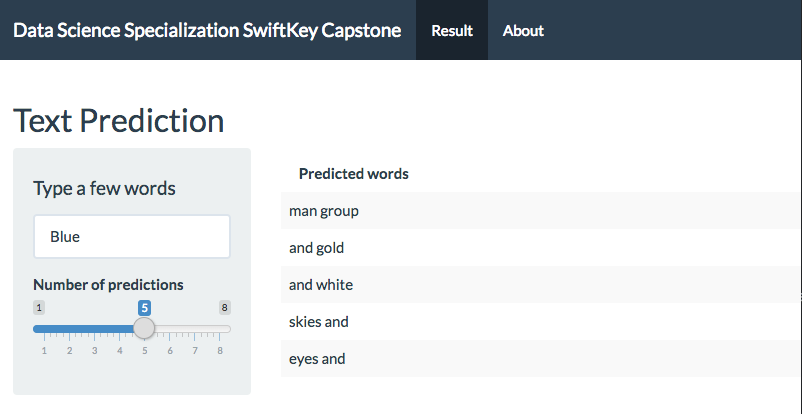

# Data Science Specialization SwiftKey Capstone

The goal of this data science specialization has been to give you the basic skills involved with being a data scientist. The goal of this capstone is to mimic the experience of being a data scientist. As a practicing data scientist it is entirely common to get a messy data set, a vague question, and very little instruction on exactly how to analyze the data. Our goal is to give you that same experience but with added support in the form of forums, discussion with instructors, feedback from SwiftKey and Coursera engineers, and a structured problem to solve. We hope that you will take advantage of the opportunity this project affords for you to demonstrate your skills and creativity.

## Course Tasks
This course will be separated into 8 different tasks that cover the range of activities encountered by a practicing data scientist. They mirror many of the skills you have developed in the data science specialization. The tasks are:

- Understanding the problem
- Data acquisition and cleaning
- Exploratory analysis
- Statistical modeling
- Predictive modeling
- Creative exploration
- Creating a data product
- Creating a short slide deck pitching your product

## Introduction

The application is the capstone project for the Coursera Data Science specialization held by professors of the Johns Hopkins University and in cooperation with SwiftKey. 

The goal of this capstone is to mimic the experience of being a data scientist. As a practicing data scientist it is entirely common to get a messy data set, a vague question, and very little instruction on exactly how to analyze the data.

## Objective

This project takes messy data, processes it for analysis, builds a predictive model and then does the actual predictions when text is entered.

N-grams are processed outside the shiny app. This ensures quick response times.

The application predicts the next two words most likely used.

## Method

After creating a data sample from the HC Corpora data, this sample was cleaned by conversion to lowercase, removing punctuation, links, white space, numbers and all kinds of special characters. This data sample was then tokenized. 

## Usage

Using the app is straight-forward. A default value of "Blue" shows a user predicted text by default. The user can then change the text and increase or decrease the number of predictions.

## References and Source Code

- [Coursera DataSci Specialization](https://www.coursera.org/specializations/jhu-data-science)
- [GitHub Repo](https://github.com/kwhaler/data-science-capstone)
- [Shiny App](https://kwhaler.shinyapps.io/Data_Science_Specialization_Capstone/)
- [Email](mailto:k@polyoptik.io)

